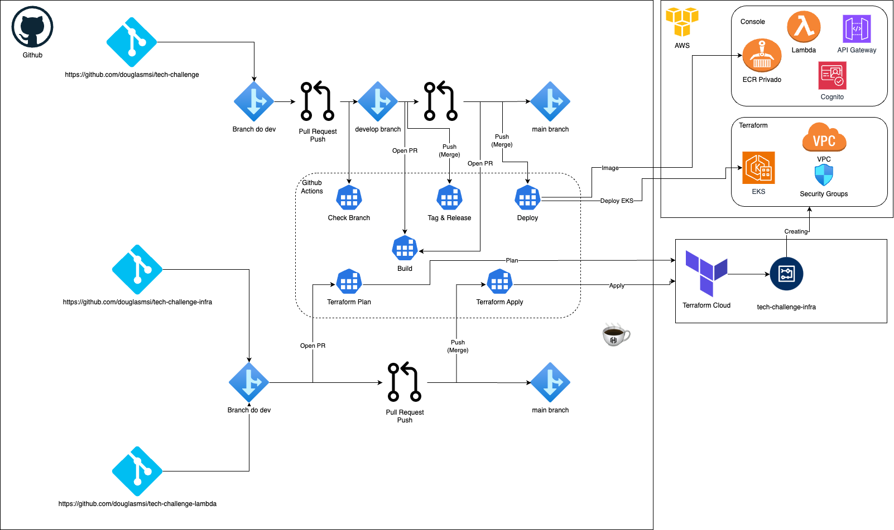

## 🍔 Fastfood

Welcome to the Fastfood documentation! 🎉🎉 This documentation provides an overview of the Fastfood application, a simple online food ordering and delivery system.

### Description

This is a simple application that allows users to order food online and have it delivered to their location. Whether you're craving a juicy burger, a delicious pizza, or a refreshing salad, Fastfood has got you covered!

### Terraform + Github Actions - Build e Deploy 



### ✅ Running the Application

To run the application, you need to have Docker and Kubernetes installed on your machine. Please follow these steps:

1. Open your terminal and navigate to the following directories of the project.
    - kuberntes/database/postgres
    - kuberntes/api

2. Run the following command on each path:

```bash
kubectl apply -f ../postgres
kubectl apply -f ../api
```

This command will start the application and set up the necessary environment.

### ⚠️ Viewing Application Logs

To view the logs of the aplication run the following command:

```bash
kubectl get pods
kubectl logs <nomedopod>
```

## Testing the application with Postman Collection

- [Postman Collection](docs/Fastfood.postman_collection.json)
- [Environment of Collection](docs/tech-challenge.postman_environment.json)

## API Documentation

[Swagger Documentation](http://localhost:8080/swagger-ui/index.html#/)

# Documentação do Fluxo de Pedido

Aqui está o fluxo de pedido em detalhes. Siga os passos abaixo para realizar um pedido com sucesso! 😊

## Passo 1: Cadastro do Cliente

Para cadastrar um cliente, precisa fazer uma solicitação POST para a rota `/clientes` com os dados necessários. Você pode utilizar o seguinte comando curl:

```shell
curl --location 'localhost:8080/clientes' \
--header 'Content-Type: application/json' \
--data-raw '{
  "cpf": "654321",
  "nome": "Nome do Cliente 2",
  "telefone": "4444555",
  "endereco": "Endereço do Cliente 2",
  "email": "cliente2@example.com"
}'
```

## Passo 2: Cadastro de Itens

Agora é hora de cadastrar os itens disponíveis. Utilize a rota `/items` para fazer uma solicitação POST e adicionar um novo item. Aqui está um exemplo de comando curl:

```shell
curl --location 'localhost:8080/items' \
--header 'Content-Type: application/json' \
--data '{
  "nome": "Batata frita",
  "descricao": "Batata frita",
  "valor": 10.00,
  "categoria": "ACOMPANHAMENTO"
}'
```

## Passo 3: Cadastrar os Métodos de Pagamento

Agora vamos cadastrar os métodos de pagamento disponíveis. Utilize a rota `/metodo-pagamentos` para fazer uma solicitação POST e adicionar um novo método de pagamento. Aqui está um exemplo de comando curl:

```shell
curl --location 'localhost:8080/metodo-pagamentos' \
--header 'Content-Type: application/json' \
--data '{
  "metodoPagamento": {
    "cvv": "123",
    "dataExpiracao": "12/24",
    "numeroCartao": "134556",
    "cpf": "22222"
  }
}'
```

## Passo 4: Cadastrar Abertura do Pedido

Agora vamos abrir um novo pedido. Utilize a rota `/pedidos` e faça uma solicitação POST para abrir um novo pedido. Aqui está um exemplo de comando curl:

```shell
curl --location 'localhost:8080/pedidos' \
--header 'Content-Type: application/json' \
--data '{
  "cpf": "123456"
}'
```

## Passo 5: Adicionar Itens ao Pedido

Agora é hora de adicionar itens ao pedido. Utilize a rota `/pedidos/itempedido/{numeroPedido}` e faça uma solicitação POST para adicionar um item ao pedido. Aqui está um exemplo de comando curl:

```shell
curl --location 'http://localhost:8080/pedidos/itempedido/FF2706234754' \
--header 'Content-Type: application/json' \
--data '{
  "numeroPedido": "FF2706234754",
  "item": {
    "id": 2
  },
  "quantidade": 1
}'
```

## Passo 6: Checkout de Pagamento

Agora vamos fazer o checkout do pagamento. Utilize a rota `/pedidos/checkout/{numeroPedido}` e faça uma solicitação POST para finalizar o pagamento do pedido. Aqui está um exemplo de comando curl:

```shell
curl --location 'http://localhost:8080/pedidos/checkout/FF2706234754' \

```

## Passo 7 - Atualizar Status do Pedido

```shell
curl --location --request PUT 'http://localhost:8080/pedidos/0' \
--header 'Content-Type: application/json' \
--data '{
  "statusPedido": "FINALIZADO",
  "cpf": "0",
  "numeroPedido": "0"
}'
```

## Passo 8 - Consultar todos Pagamentos e/ou especifico

```shell 

curl --location 'http://localhost:8080/pagamentos'
```


```shell
curl --location 'http://localhost:8080/pagamentos/{{id}}'
```